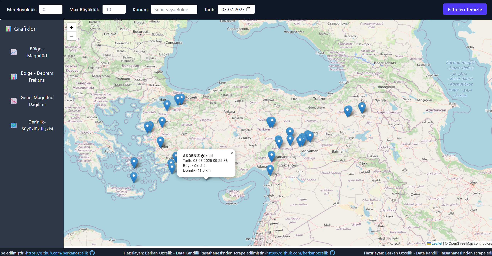

# 🌍 Deprem Veri İzleme ve Analiz Projesi

> Türkiye geneli deprem verilerini **web scraping** ile toplayan, veri tabanına kaydeden, REST API sunan ve interaktif grafiklerle analiz eden tam donanımlı modern uygulama.

---




## 🚀 Proje Özeti

Bu proje, Türkiye genelindeki deprem verilerini farklı kaynaklardan otomatik olarak çekip güncelleyen bir **backend** servisi ve bu verileri kullanıcı dostu bir şekilde görselleştiren **frontend** uygulamasından oluşmaktadır.  

Backend tarafında, Axios ve Cheerio kullanılarak deprem bilgileri belirli aralıklarla web üzerinden kazınmakta (scraping), elde edilen veriler PostgreSQL veritabanında güvenli şekilde saklanmaktadır. Node-cron ile zamanlanmış görevler sayesinde veri güncelliği otomatik olarak sağlanmaktadır.  

Frontend ise React ve Redux Toolkit tabanlı olup, D3.js ile zengin ve etkileşimli grafikler sunar. Leaflet kütüphanesi sayesinde depremlerin coğrafi konumları harita üzerinde dinamik olarak gösterilir. Kullanıcılar filtreleme yaparak, belli bölge, tarih aralığı veya büyüklük kriterlerine göre verileri kolayca inceleyebilir. Tüm bu kullanıcı arayüzü, modern ve hızlı stil framework’ü TailwindCSS ile geliştirilmiştir.

---

## 🧩 Teknolojiler & Mimari

| Katman       | Teknoloji & Kütüphane            | Açıklama                                       | Emoji  |
|--------------|---------------------------------|------------------------------------------------|--------|
| Backend      | Node.js, Express.js              | RESTful API geliştirme ve sunucu yönetimi       | 🖥️     |
|              | Axios, Cheerio                  | Web scraping (veri çekme ve HTML parsing)       | 🕷️     |
|              | node-cron                      | Zamanlanmış otomatik görevler (veri güncelleme) | ⏰     |
|              | PostgreSQL                     | İlişkisel veritabanı yönetimi ve sorgulama      | 🗄️     |
| Frontend     | React                         | Tek sayfa uygulama (SPA) arayüz geliştirme      | ⚛️     |
|              | Redux Toolkit                 | Merkezi durum yönetimi ve veri akışı kontrolü    | 🔄     |
|              | D3.js                        | Veri görselleştirme, etkileşimli grafikler       | 📊     |
|              | Leaflet                      | İnteraktif harita ve coğrafi veri gösterimi      | 🗺️     |
|              | TailwindCSS                  | Hızlı, duyarlı ve modern tasarım                  | 🎨     |

---

## 🏗️ Proje Yapısı

```plaintext
/
├─ backend/               # Node.js tabanlı API ve scraping servisleri
│  ├─ controllers/        # API endpoint’lerinin iş mantığı (örn: earthquakeController.js)
│  ├─ routes/             # API rotalarının tanımlandığı dosyalar
│  ├─ services/           # Web scraping ve zamanlanmış görevlerin kodları
│  ├─ db/                 # Veritabanı bağlantı ve sorgu işlemleri (PostgreSQL)
│  ├─ middleware/         # İsteğe bağlı ara katmanlar (auth, logger vb.)
│  ├─ utils/              # Yardımcı fonksiyonlar ve genel araçlar
│  ├─ .env                # Çevresel değişkenler ve gizli anahtarlar
│  └─ index.js            # Uygulamanın ana giriş noktası
│
├─ frontend/              # React tabanlı tek sayfa uygulaması (SPA)
│  ├─ components/         # Grafikler, filtreler, modal pencereler gibi UI parçaları
│  ├─ redux/              # Uygulama genel durumu için store ve slice’lar
│  ├─ hooks/              # Özel React hook’ları (isteğe bağlı)
│  ├─ services/           # API çağrıları ve veri yönetimi yardımcıları
│  ├─ styles/             # TailwindCSS konfigürasyonları ve özel stiller
│  ├─ public/             # Statik dosyalar (favicon, index.html vb.)
│  └─ vite.config.js      # Vite build aracının yapılandırması
│
├─ docker-compose.yml     # Backend, frontend ve PostgreSQL servislerini tek komutla ayağa kaldırma
├─ backend/Dockerfile     # Backend servisinin Docker imajı tanımı
├─ frontend/Dockerfile    # Frontend servisinin Docker imajı tanımı
├─ .gitignore
├─ README.md
└─ package.json           # Projenin bağımlılıkları ve script’leri
```

# 🔥 Projenin Öne Çıkan Özellikleri

### 🔍 Web Scraping  
Proje, Türkiye’deki deprem verilerini çeşitli resmi ve güvenilir kaynaklardan Axios ve Cheerio ile otomatik olarak çekip, parse ederek veritabanına kaydeder. Böylece veriler her zaman güncel kalır.

### ⏲️ Zamanlanmış Görevler  
Node-cron kütüphanesi sayesinde scraping işlemleri belli aralıklarla (örneğin her saat) otomatik tekrarlanır. Böylece manuel müdahaleye gerek kalmadan veri güncelliği sağlanır.

### 📈 Detaylı ve Etkileşimli Grafikler  
D3.js kullanarak deprem büyüklüğü, derinlik, zaman aralığı gibi parametrelerde kullanıcıların rahatlıkla inceleme yapabileceği etkileşimli grafikler sunulur. Grafikler, veri analizi ve görsel raporlama için idealdir.

### 🗺️ Dinamik Harita Entegrasyonu  
Leaflet kütüphanesi ile deprem olayları harita üzerinde gösterilir, kullanıcılar yakınlaştırma, uzaklaştırma ve bölge seçme gibi işlemler yapabilir.

### 🔍 Kullanıcı Dostu Filtreleme  
Bölge, tarih aralığı ve deprem büyüklüğü gibi kriterlere göre filtreleme yaparak kullanıcıların istedikleri verilere kolay erişimi sağlanır.

### 🐳 Docker Desteği  
Backend, frontend ve veritabanını içeren Dockerfile ve docker-compose.yml dosyaları ile projeyi yerel veya sunucu ortamında hızlıca konteyner olarak çalıştırabilirsiniz. Bu sayede ortam bağımsızlığı ve kolay dağıtım imkanı sunar.


